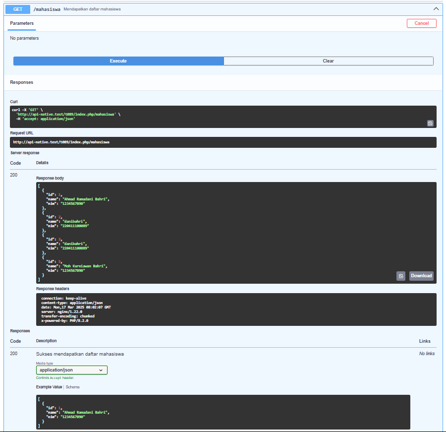
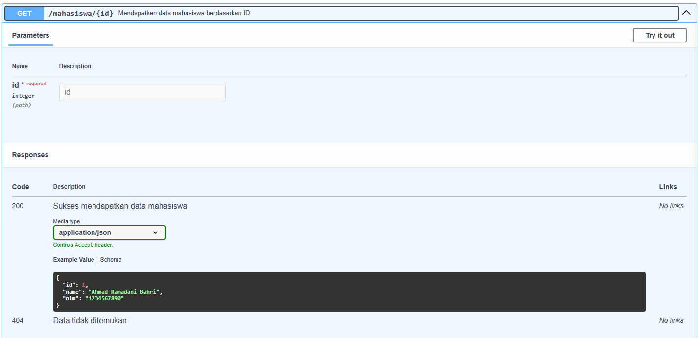
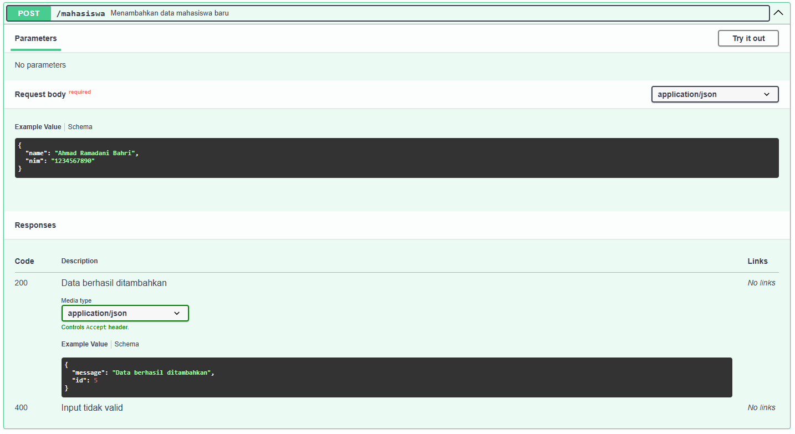
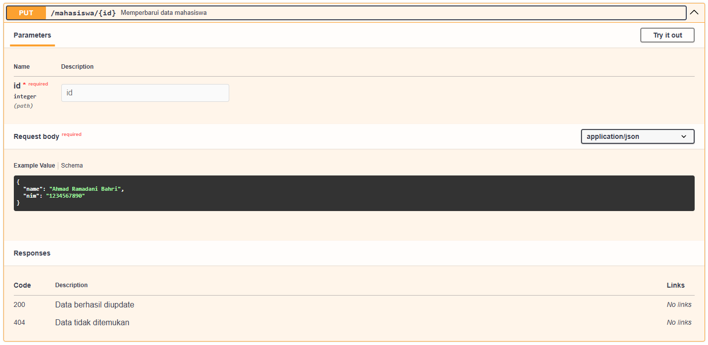
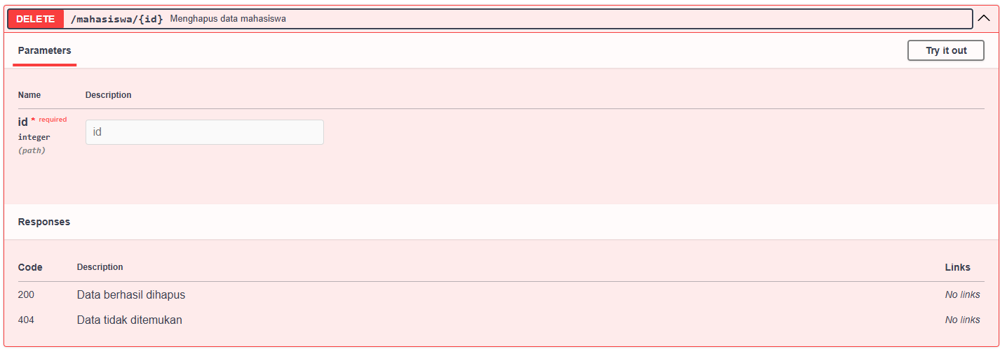

# API With PHP Native

Create API using PHP Native with REQUEST Method (GET (all and by id), POST, PUT(by id) and DELETE(by id)) with documentation below

First configure db.php so that it can connect to your database.

Running with NGINX server in laragon using Domain Custom Laragon (examaple.test) or acccess domain below:

```bash
https://kuliah2025.my.id/t089/index.php/mahasiswa
```

Testing using POSTMAN or Documentation in Swagger

### GET all Mahasiswa

```bash
..../t089/index.php/mahasiswa
```



### GET by ID

```bash
..../t089/index.php/mahasiswa/{id}
```



### POST

```bash
..../t089/index.php/mahasiswa/{id}
```



### PUT

```bash
..../t089/index.php/mahasiswa/{id}
```



### DELETE

```bash
..../t089/index.php/mahasiswa/{id}
```


