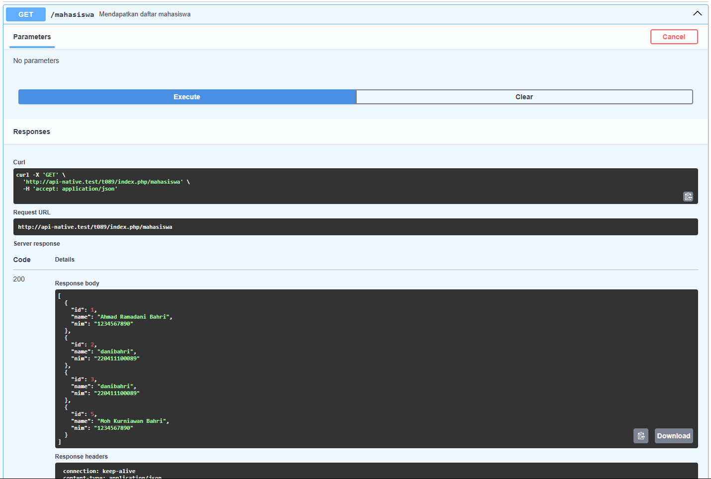

# API With PHP Native

Create an API using PHP Native with REQUEST Method (GET (all and by id), POST, PUT (by id) and DELETE (by id)) with the documentation below

### important!

why is my path localhost/t089/index.php/mahasiswa not localhost/mahasiswa, because my index.php file is located in the /t089 folder, if you want the path to be localhost/mahasiswa use the index.php and db.php files that I have prepared outside the /t089 folder and modify the swagger according to what is in the /t089 folder

First configure db.php so that it can connect to your database.

Run with NGINX server in laragon using Laragon Custom Domain (examaple.test) or access the domain below for Swagger Documentation:

```bash
https://kuliah2025.my.id/t089/index.php/mahasiswa
```

Testing using POSTMAN or Documentation in Swagger

### GET all Mahasiswa

```bash
..../t089/index.php/mahasiswa
```



### GET by ID

```bash
..../t089/index.php/mahasiswa/{id}
```


### POST

```bash
..../t089/index.php/mahasiswa/{id}
```


### PUT

```bash
..../t089/index.php/mahasiswa/{id}
```


### DELETE

```bash
..../t089/index.php/mahasiswa/{id}
```


